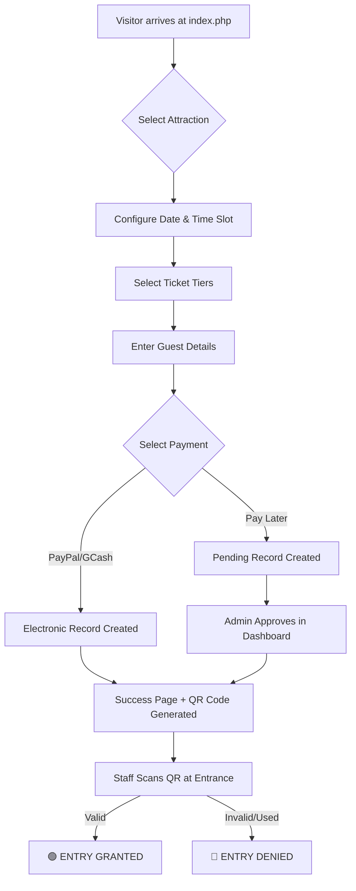

# 🗺️ Tour Guide System (Under Production)

> [!IMPORTANT]
> **🚀 PROJECT STATUS:** ACTIVE PRODUCTION / UNDER DEVELOPMENT
> This system is currently being refined. Key features like the mobile-responsive QR Scanner and Automated Email Reminders are in the implementation phase.

## 🌟 Overview
The **Tour Guide System** is a premium, end-to-end digital solution designed to streamline the tourist experience in the Philippines. It bridges the gap between local attractions and visitors through a seamless booking engine, secure payment integrations, and a robust administrative backend for site managers.

---

## 🏗️ System Architecture

The project is built on a high-performance **PHP/MySQL** architecture with a modern, vanilla JS/CSS frontend.

### 1. Public Discovery & Booking (`index.php`, `booking.php`)
The gateway for tourists. It provides a "wow" factor with vibrant designs, smooth animations, and an intuitive multi-step booking process.
- **Dynamic Catalog**: Fetches real-time attraction data, including multi-image carousels and YouTube trailers.
- **Intelligent Scheduler**: Prevents overbooking by checking real-time slot capacity and blackout dates (Holidays/Maintenance).
- **Guest-First Experience**: No account required—tourists can book as guests for maximum speed.

### 2. Admin Command Center (`admin.php`)
A comprehensive dashboard for staff and local government units (LGUs).
- **Dashboard Analytics**: Real-time stats on today's check-ins vs. expected visitors.
- **Attraction Factory**: Create and edit tourist spots with custom pricing (Adult/Child/Senior) and designated time slots.
- **Order Management**: A powerful table to **Approve**, **Reject**, or **Refund** bookings. Supports "Pay Later" verification.

### 3. Backend API Engine (`backend/api_bookings.php`)
The "brain" of the system.
- **Reservation Logic**: Handles atomic transactions to ensure data integrity during high-traffic booking windows.
- **QR Generation**: Creates cryptographically unique ticket hashes to prevent fraud.

---

## 🔄 How the System Works (Thorough Breakdown)

### 🟢 The User Journey
1.  **Discovery**: User browses attractions on the landing page.
2.  **Configuration**: User selects a **Date** (filtered by blackout dates) and a **Time Slot** (Morning/Afternoon).
3.  **Tickets**: User chooses ticket quantities (Adult/Child/Senior). The system calculates the price dynamically based on any **Seasonal Multipliers**.
4.  **Guest Details**: User enters Name, Email, and Phone.
5.  **Payment**:
    -   **PayPal**: Immediate secure transaction.
    -   **GCash**: User scans the admin QR code and enters a 13-digit reference number for verification.
    -   **Pay Later**: Immediate approval for later fulfillment at the physical ticketing booth.
6.  **Success**: User receives a unique **Booking Reference** and a digital ticket with a **QR Code**.

### 🔵 The Admin Logic
1.  **Management**: Admins monitor the "Pending" list. For GCash or Pay Later, they manually check the reference/payment and click **Approve**.
2.  **Validation**: Staff use the **Entry Validator** to scan visitor QR codes.
3.  **Governance**: Admins set **Blackout Dates** for maintenance or localized holidays using the integrated Philippine Holiday logic.

---

## 📊 Process Flowchart

---

## ⚙️ Technical Deep-Dive

### 1. QR Code Security
Instead of simple sequential IDs, the system generates a unique hash based on:
`SHA256(booking_id + random_bytes(8) + secret_salt)`
This ensures that tickets cannot be guessed or forged.

### 2. Dynamic Pricing (Seasonal Matrix)
The system calculates the final price using a **Seasonal Factor**:
`Final Price = Base Price * Multiplier`
- **Peak Seasons** (e.g., Holy Week, Christmas): +20%
- **Off-Peak** (e.g., Rainy Season): -15%
This logic is stored in the `seasonal_pricing` table and applied automatically at checkout.

---

## 🚀 Essential Features (Part 5 Implementation)

We are currently implementing the following critical pillars for the production release:

### 1. Specialized QR Scanner Interface
- **Mobile-Responsive Scanner**: A dedicated, ultra-low-latency interface for field staff.
- **Instant Status**:
    - **GREEN**: Valid/Not yet scanned.
    - **RED**: Already used or expired.
- **Headcount Verification**: The scanner explicitly displays the **Group Size** and **Ticket Types** to verify the physical headcount at the gate.

### 2. Automated Communication Pipeline
- **24-Hour Reminder**: The system will automatically trigger an email 24 hours before the visit date, resending the QR code and providing Google Maps directions.
- **Post-Visit Feedback**: 2 hours after a time slot ends, a survey is sent to the visitor to collect reviews and improve service quality.

### 3. Integrated Pricing Calendar
- Visual "Heatmap" for admins to manage pricing multipliers and capacity limits across a full calendar year.

---

## 🛠️ Installation

1.  **Host**: Place the project in `xampp/htdocs/Tour_Guide_System`.
2.  **Database**: Import the latest schema from `backend/config.php` (connection details).
3.  **Dependencies**: PHPMailer is included for automated notifications.
4.  **Access**: Visit `localhost/Tour_Guide_System/index.php` for users or `admin.php` for management.

---
*Developed with ❤️ for the Philippine Tourism industry.*
default credenitals
admin: admin@yourstruly@gmail.com
password: admin123
