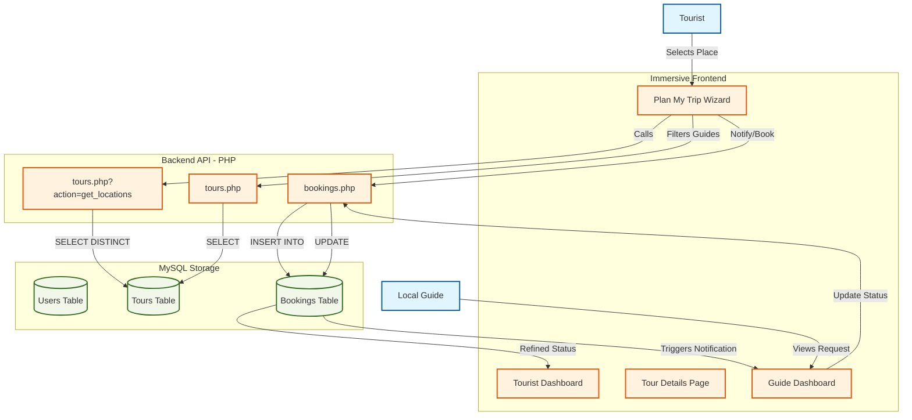

# Tour Guide System (Prototype)

> **Status:** Under Production / Prototype
> **Developer:** Sonjeev Cabardo
> **Phase:** Advanced UI Revamp & Location Discovery Flow 🚀

A premium web-based platform connecting tourists with professional local guides in the Philippines. The system features a unique, high-end dashboard experience for both users and a logical location-first discovery flow.

## ✨ Recent Revamp Highlights

### 🎨 Premium Dashboard Experience
- **Unique Branding:** Distinct visual themes for Tourists (Teal/Cyan) and Guides (Orange/Gold), ensuring a premium feel for both roles.
- **Glassmorphism UI:** Modern, translucent elements with sleek shadows and Inter typography.
- **Real-time Statistics:** Instant overview of bookings (Pending, Confirmed, Total) directly on the dashboard.

### 🧭 Location-First Discovery ("Plan My Trip")
We've introduced a logical 3-step planning flow for tourists:
1. **Choose Destination:** Select from unique, approved locations across the PH.
2. **Find Local Guide:** Discover guides and tours specifically active in that area.
3. **Notify & Book:** Instantly notify the guide and create a booking request.

### 🖼️ Immersive Tour Details
- Full-width hero sections with gradient overlays.
- Sticky booking widgets for an intuitive reservation process.
- Responsive design for seamless browsing on mobile and desktop.

## 📊 System Flow Diagram



## 🛠️ Technology Stack

- **Frontend:** HTML5, CSS3 (Vanilla + Modern Tokens), JavaScript (ES6+), AJAX
- **Backend:** PHP (Vanilla)
- **Database:** MySQL
- **Design:** Inter Fonts, HSL-based Palettes, Glassmorphism CSS

## 📥 How to Clone & Run

1.  **Install XAMPP:**
    - Download and install [XAMPP](https://www.apachefriends.org/index.html).
    - Start Apache and MySQL.

2.  **Clone the Repository:**
    ```bash
    cd c:/xampp/htdocs
    git clone <repository_url> Tour_Guide_System
    ```

3.  **Setup the Database:**
    - Go to `http://localhost/phpmyadmin`.
    - Create `tour_guide_db`.
    - Import `backend/database.sql`.

4.  **Run:**
    - Navigate to `http://localhost/Tour_Guide_System`.

## 📝 Usage

1.  **Register/Login:** Choose "Tourist" or "Guide".
2.  **Plan Trip (Tourist):** Use the 🧭 sidebar to find guides by destination.
3.  **Manage (Guide):** Track notifications and booking requests in your dedicated dashboard.
4.  **Explore:** Browse all tours via the 🌍 "Explore" tab.
